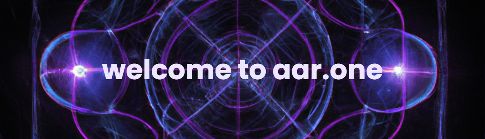

[](https://aar.one)

# Oi, World! Im Aaron 👋


<div class="github-introduction">

Im a **Web Developer** who loves to bring ideas to life in the browser. I grew up in the 90's early 2000's and fell in love with the internet. Therefore I am excited about designing and developing websites and web applications that are **fast**, **responsive**, and **accessible** to everyone. Also, I kind of want to bring back the 90's web design aesthetic. I think it was cool. 😎

</div>

- 💼 Got a freelance gig? Hit me up via <a href="mailto:code@aar.one">email.</a>
- 💬 Curious? Just ask!

<div class="badges-intro">


</div>

## 📈 My GitHub stats

<div class="badges-githubstats">
  <p align="center">
    
    
  </p>
</div>

## 📃 I love documentation

Not many developers like to write documentation. I do though. I believe that a well-documented codebase is as important as the code itself. Its like a story telling what the code can do and how it does it. I always try to write clear, concise, and useful documentation. My go-to documentation tool is <a href="https://obsidian.md/" target="_blank">Obsidian.md</a>.

Whenever I write documentation i try to follow keep in mind the following steps to make sure the reader gets the most out of it:

```markdown
1. **What** is this documentation about?
2. **Why** is this documentation important?
3. **How** can the reader use this documentation?
4. **When** should the reader use this documentation?
5. **Who** is this documentation for?
```


### <p align="center">⚙️ My development environment </p>

> I grew up with Windows and have a special place in my heart for it. Its my go-to operating system for development. I enjoy using the Windows Subsystem for Linux (WSL) and the Windows Terminal. I also use <a href="https://docs.microsoft.com/en-us/powershell/" target="_blank">PowerShell</a> configured with <a href="https://ohmyposh.dev/" target="_blank">Oh-My-Posh</a> for my terminal.

<div class="table-devenvironment">
  <table style="font-size: 11px">
  <tr>
  <td valign="top" width="50%">
  
  #### 🖥️ Windows Power User
  
  
  
  
  
  
  </td>
  <td valign="top" width="50%">
  
  #### 🐧 Linux Enthusiast
  
  I love working with Linux and Im always exploring new things in the vast open-source world.
  
  
  
  
  
  
  
  </td>
  </tr>
  </table>
</div>
