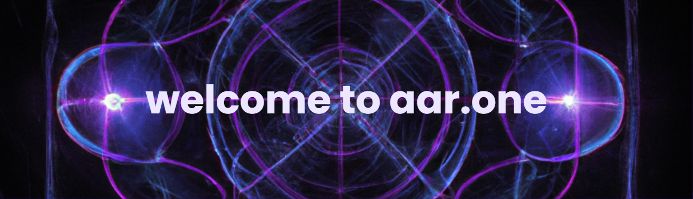

[](https://github.com/aaronedev)

# Oi, World! I'm Aaron


<a href="https://wakatime.com/@018cc02c-e893-42e6-b1c7-48cb3ef3ccfe">
  
</a>
[](https://github.com/aaronedev/aaronedev/actions/workflows/readme.yaml)

> Linux desktop engineering • rootless containers • Hyprland workflows •
> Neovim configs & Themes

## 📬 About me -- Contact
- Matrix: <a href="https://matrix.to/#/@aaronedev:matrix.org" target="_blank">@aaronedev:matrix.org</a>
- Brieftaube: <a href="https://de.wikipedia.org/wiki/Brieftaube" target="_blank">Homing Pigeon</a> send it to cologne 50.951811223028265, 6.986298711065432

> [!IMPORTANT]
> Don't take urself too seriously, we're all pretty dumbs here.

<div class="badges-githubstats">
  
  
</div>

## 🔧 What I do now
- Build secure, rootless **Podman** dev setups
- Engineer **Hyprland** desktop workflows and theming
- Ship **python-utility** apps: offline TTS tools powered by **Piper**
  - Example: clipboard-reader aka [read-that](https://github.com/aaronedev/read-that) 📢
 that auto-detects **EN/DE**, switches voices, and takes flags for speed, pitch, and voice
- Bash scripting: small, composable CLI tools
- Linux and network fundamentals for real deployments


## ✨ I can help with
- Bash Scripting and automation
- Hardening dev containers and CI without Docker
- Modular **Hyprland** configs, rules, and automation
- **Neovim** UX: colors, LSP, performance
- Offline TTS pipelines with **Piper** and clean CLI ergonomics

## 🌟 Featured projects
- 🎨 **Violet Void Theme** — core color system powering matching themes across apps (ArchWiki, CopyQ, more)\
  [`aaronedev/violet-void-theme`](https://github.com/aaronedev/violet-void-theme)
  - ArchWiki: restyles the ArchWiki with a violet void palette\
    [`aaronedev/violet-void-theme_archwiki`](https://github.com/aaronedev/violet-void-theme_archwiki)
  - CopyQ: matching CopyQ theme for a cohesive desktop\
    [`aaronedev/violet-void-theme_copyq`](https://github.com/aaronedev/violet-void-theme_copyq)
- 🧩 **zen-mods** — modular ergonomics toolkit for Hyprland workspaces\
  [`aaronedev/zen-mods`](https://github.com/aaronedev/zen-mods)
  - zen-floating-bookmarks: lightweight floating bookmark UX\
    [`aaronedev/zen-floating-bookmarks`](https://github.com/aaronedev/zen-floating-bookmarks)
  - zen-spotlight *(in progress)* — rapid launcher overlays for Hyprland

## 📝 Docs workflow
All notes in Neovim via [obsidian.nvim](https://github.com/obsidian-nvim/obsidian.nvim) on plain Markdown.

---

## ⭐ Recent activity


### 🔁 Fresh Pull Requests

- ⚫ [🐛 fix: config version fixed from 1.1.14 to 1.1.16](https://github.com/hyprland-community/hyprland-autoname-workspaces/pull/129) in [`hyprland-community/hyprland-autoname-workspaces`](https://github.com/hyprland-community/hyprland-autoname-workspaces) • 3 months ago\
  <sub>Hyprland autoname workspaces 🪟 [maintainers=@cyrinux,@maximbaz,@matt-fff] </sub>

- 🟢 [New version: Google.Chrome.Dev version 122.0.6226.2](https://github.com/microsoft/winget-pkgs/pull/133318) in [`microsoft/winget-pkgs`](https://github.com/microsoft/winget-pkgs) • 2 years ago\
  <sub>The Microsoft community Windows Package Manager manifest repository</sub>


### 🛠️ Latest Contributions

- 🔗 [`aaronedev/nerdfont-icon-rofi-picker`](https://github.com/aaronedev/nerdfont-icon-rofi-picker) • today\
  <sub>A simple rofi-based picker for nerd font icons. Browse through thousands of icons with fuzzy search and copy them to your clipboard.</sub>

- 🔗 [`aaronedev/violet-void-theme_archwiki`](https://github.com/aaronedev/violet-void-theme_archwiki) • 4 weeks ago\
  <sub>Dark Violet-Void theme using a consistent handcrafted color palette for a unified look across the OS and web. I use those colors for my whole OS, and it&#39;s🔥</sub>

- 🔗 [`aaronedev/zen-floating-bookmarks`](https://github.com/aaronedev/zen-floating-bookmarks) • 4 weeks ago\
  <sub>zen-browser mod floating bookmarks </sub>

- 🔗 [`aaronedev/zen-container-colors`](https://github.com/aaronedev/zen-container-colors) • 4 weeks ago

- 🔗 [`aaronedev/violet-void-theme_telegram`](https://github.com/aaronedev/violet-void-theme_telegram) • 1 month ago\
  <sub>telgram violet-void-theme</sub>


### ✨ WakaTime stats ✨
<details>
  <summary>Click to expand the latest metrics</summary>

<!--START_SECTION:waka-->
**🐱 My GitHub Data** 

> 📦 4.3 MB Used in GitHub's Storage 
 > 
> 🏆 5,036 Contributions in the Year 2025
 > 
> 💼 Opted to Hire
 > 
> 📜 24 Public Repositories 
 > 
> 🔑 99 Private Repositories 
 > 
**I'm an Early 🐤** 

```text
🌞 Morning                40 commits          ⬛⬛⬛⬛⬛⬛⬜⬜⬜⬜⬜⬜⬜⬜⬜⬜⬜⬜⬜⬜⬜⬜⬜⬜⬜   23.26 % 
🌆 Daytime                67 commits          ⬛⬛⬛⬛⬛⬛⬛⬛⬛⬛⬜⬜⬜⬜⬜⬜⬜⬜⬜⬜⬜⬜⬜⬜⬜   38.95 % 
🌃 Evening                26 commits          ⬛⬛⬛⬛⬜⬜⬜⬜⬜⬜⬜⬜⬜⬜⬜⬜⬜⬜⬜⬜⬜⬜⬜⬜⬜   15.12 % 
🌙 Night                  39 commits          ⬛⬛⬛⬛⬛⬛⬜⬜⬜⬜⬜⬜⬜⬜⬜⬜⬜⬜⬜⬜⬜⬜⬜⬜⬜   22.67 % 
```
📅 **I'm Most Productive on Monday** 

```text
Monday                   66 commits          ⬛⬛⬛⬛⬛⬛⬛⬛⬛⬛⬜⬜⬜⬜⬜⬜⬜⬜⬜⬜⬜⬜⬜⬜⬜   38.37 % 
Tuesday                  15 commits          ⬛⬛⬜⬜⬜⬜⬜⬜⬜⬜⬜⬜⬜⬜⬜⬜⬜⬜⬜⬜⬜⬜⬜⬜⬜   08.72 % 
Wednesday                36 commits          ⬛⬛⬛⬛⬛⬜⬜⬜⬜⬜⬜⬜⬜⬜⬜⬜⬜⬜⬜⬜⬜⬜⬜⬜⬜   20.93 % 
Thursday                 10 commits          ⬛⬜⬜⬜⬜⬜⬜⬜⬜⬜⬜⬜⬜⬜⬜⬜⬜⬜⬜⬜⬜⬜⬜⬜⬜   05.81 % 
Friday                   23 commits          ⬛⬛⬛⬜⬜⬜⬜⬜⬜⬜⬜⬜⬜⬜⬜⬜⬜⬜⬜⬜⬜⬜⬜⬜⬜   13.37 % 
Saturday                 5 commits           ⬛⬜⬜⬜⬜⬜⬜⬜⬜⬜⬜⬜⬜⬜⬜⬜⬜⬜⬜⬜⬜⬜⬜⬜⬜   02.91 % 
Sunday                   17 commits          ⬛⬛⬜⬜⬜⬜⬜⬜⬜⬜⬜⬜⬜⬜⬜⬜⬜⬜⬜⬜⬜⬜⬜⬜⬜   09.88 % 
```


📊 **This Week I Spent My Time On** 

```text
🕑︎ Time Zone: Europe/Berlin

💬 Programming Languages: 
Markdown                 5 hrs 41 mins       ⬛⬛⬛⬛⬜⬜⬜⬜⬜⬜⬜⬜⬜⬜⬜⬜⬜⬜⬜⬜⬜⬜⬜⬜⬜   15.75 % 
YAML                     5 hrs 17 mins       ⬛⬛⬛⬛⬜⬜⬜⬜⬜⬜⬜⬜⬜⬜⬜⬜⬜⬜⬜⬜⬜⬜⬜⬜⬜   14.66 % 
Smarty                   4 hrs 4 mins        ⬛⬛⬛⬜⬜⬜⬜⬜⬜⬜⬜⬜⬜⬜⬜⬜⬜⬜⬜⬜⬜⬜⬜⬜⬜   11.29 % 
Lua                      3 hrs 29 mins       ⬛⬛⬜⬜⬜⬜⬜⬜⬜⬜⬜⬜⬜⬜⬜⬜⬜⬜⬜⬜⬜⬜⬜⬜⬜   09.69 % 
hyprlang                 2 hrs 38 mins       ⬛⬛⬜⬜⬜⬜⬜⬜⬜⬜⬜⬜⬜⬜⬜⬜⬜⬜⬜⬜⬜⬜⬜⬜⬜   07.31 % 

🔥 Editors: 
Neovim                   36 hrs 2 mins       ⬛⬛⬛⬛⬛⬛⬛⬛⬛⬛⬛⬛⬛⬛⬛⬛⬛⬛⬛⬛⬛⬛⬛⬛⬛   99.74 % 
VS Code                  5 mins              ⬜⬜⬜⬜⬜⬜⬜⬜⬜⬜⬜⬜⬜⬜⬜⬜⬜⬜⬜⬜⬜⬜⬜⬜⬜   00.26 % 

🐱‍💻 Projects: 
dotfiles                 16 hrs 23 mins      ⬛⬛⬛⬛⬛⬛⬛⬛⬛⬛⬛⬜⬜⬜⬜⬜⬜⬜⬜⬜⬜⬜⬜⬜⬜   45.36 % 
aaronedev                9 hrs 46 mins       ⬛⬛⬛⬛⬛⬛⬛⬜⬜⬜⬜⬜⬜⬜⬜⬜⬜⬜⬜⬜⬜⬜⬜⬜⬜   27.04 % 
Unknown Project          3 hrs 37 mins       ⬛⬛⬛⬜⬜⬜⬜⬜⬜⬜⬜⬜⬜⬜⬜⬜⬜⬜⬜⬜⬜⬜⬜⬜⬜   10.03 % 
cheatsheets              2 hrs 56 mins       ⬛⬛⬜⬜⬜⬜⬜⬜⬜⬜⬜⬜⬜⬜⬜⬜⬜⬜⬜⬜⬜⬜⬜⬜⬜   08.15 % 
read-that                1 hr 38 mins        ⬛⬜⬜⬜⬜⬜⬜⬜⬜⬜⬜⬜⬜⬜⬜⬜⬜⬜⬜⬜⬜⬜⬜⬜⬜   04.56 % 

💻 Operating System: 
Linux                    36 hrs 8 mins       ⬛⬛⬛⬛⬛⬛⬛⬛⬛⬛⬛⬛⬛⬛⬛⬛⬛⬛⬛⬛⬛⬛⬛⬛⬛   100.00 % 
```

**I Mostly Code in Shell** 

```text
Shell                    18 repos            ⬛⬛⬛⬛⬛⬛⬜⬜⬜⬜⬜⬜⬜⬜⬜⬜⬜⬜⬜⬜⬜⬜⬜⬜⬜   24.32 % 
HTML                     8 repos             ⬛⬛⬛⬜⬜⬜⬜⬜⬜⬜⬜⬜⬜⬜⬜⬜⬜⬜⬜⬜⬜⬜⬜⬜⬜   10.81 % 
Python                   4 repos             ⬛⬜⬜⬜⬜⬜⬜⬜⬜⬜⬜⬜⬜⬜⬜⬜⬜⬜⬜⬜⬜⬜⬜⬜⬜   05.41 % 
Dockerfile               3 repos             ⬛⬜⬜⬜⬜⬜⬜⬜⬜⬜⬜⬜⬜⬜⬜⬜⬜⬜⬜⬜⬜⬜⬜⬜⬜   04.05 % 
Stylus                   2 repos             ⬛⬜⬜⬜⬜⬜⬜⬜⬜⬜⬜⬜⬜⬜⬜⬜⬜⬜⬜⬜⬜⬜⬜⬜⬜   02.70 % 
```


**Timeline**


 Last Updated on 03/10/2025 18:08:08 UTC
<!--END_SECTION:waka-->

</details>
