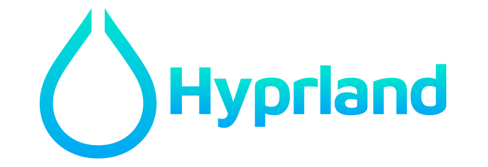

# Oi, World! I'm Aaron 👋

I originally started out in web development, building fast and accessible applications with a focus on frontend usability. Over time, my interest expanded toward infrastructure and systems engineering, leading me to begin formal training as an IT Specialist for System Integration (Fachinformatiker für Systemintegration). Right now, I'm diving deep into network engineering, Linux system internals, and containerization technologies.

Along the way, I discovered a strong preference for Podman over Docker – and I now consider myself a true Podman enthusiast, using it to build secure, rootless container environments tailored for real-world deployments.

- 💼 Interested in working together? Reach out to me!
- 💬 Got a question or just curious about something? Feel free to ask! HMU on <a href="https://matrix.to/#/@aaronedev:matrix.org" target="_blank">matrix</a>.

  
  
  
  
  

## 🌟 Featured Projects

### 🌌 Violet Void: Complete Desktop Environment

**Current Status**: Active development for <a href="https://hyprland.org" target="_blank">Hyprland</a> | <a href="https://github.com/aaronedev/violet-void-theme" target="_blank">violet-void-theme</a>

What started as Windows theming evolved into a full Linux desktop environment. The current Hyprland implementation includes:

**Core Infrastructure:**

- **Modular Hyprland Configuration**: 2000+ lines across 60+ applications with dynamic workspace management
- **Automated Theme System**: Consistent color schemes across terminals, editors, browsers, and system applications
- **Custom Scripts & Automation**: 15+ utility scripts for window management, media control, and system monitoring

The project demonstrates end-to-end Linux desktop engineering - from low-level system configuration to application theming and workflow automation. Each component is designed for modularity and can be deployed independently or as part of the complete environment.

## 📈 My GitHub stats

  

    
    
  

## 📝 Documentation with Neovim & Markdown

I believe documentation should be as elegant as the code it describes. While I previously worked with Obsidian, I now write all my notes and docs in [Neovim](https://neovim.io/) using the [obsidian.nvim](https://github.com/obsidian-nvim/obsidian.nvim) plugin – still powered by clean, portable Markdown. It gives me a minimal yet powerful setup that's fully integrated into my workflow.

## 🚀 Current Focus

- 🔭 I'm currently working on **enhancing my Hyprland configuration** (which is pretty massive already). I plan to release it soon.
- ⚙️ Continously configuring my neovim setup, which is for now very minimalistic, but it just works.
- 🌱 I'm learning **advanced network engineering concepts**, studying for my Ausbildung.
- 🧪 Experimenting with **rootless container security patterns**.

## 🧰 My Tech Evolution

  <table>
    <tr>
      <td align="center">
        
      </td>
      <td align="center">
        
      </td>
      <td align="center">
        
      </td>
    </tr>
    <tr>
      <td>
        

          
          
          
          
        

      </td>
      <td>
        

          
          
          
          
        

      </td>
      <td>
        

          
          
          
        

      </td>
    </tr>
  </table>

