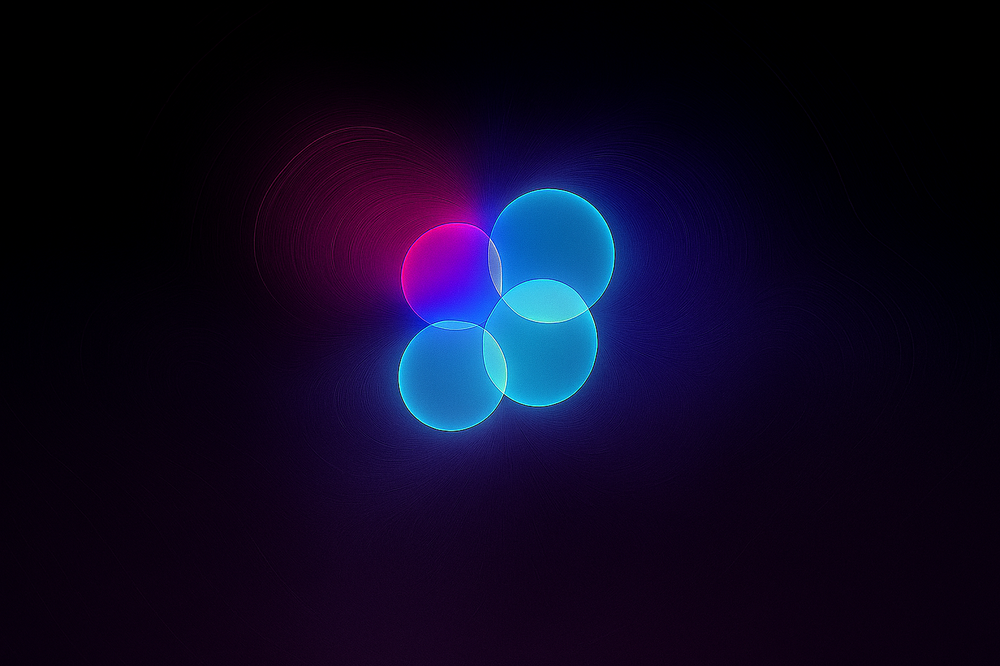

<p align="center">
  <a href="https://github.com/aaronedev">
    
  </a>
</p>

<h1 align="center">Aaron / aaronedev</h1>

<p align="center">
  I build Linux-first tools for my own workflow: Hyprland and Quickshell desktop UX, Neovim and terminal ergonomics, rootless dev environments, local voice/transcription utilities, and agent-assisted coding setups.
</p>

<p align="center">
  The header above is part of the <strong>Violet Void</strong> aesthetic: a carefully handcrafted color system I use across my desktop, tools, themes, and web surfaces.
</p>

<p align="center">
  <a href="https://github.com/aaronedev">
    
  </a>
  <a href="https://github.com/aaronedev?tab=followers">
    
  </a>
  <a href="https://github.com/aaronedev?tab=repositories">
    
  </a>
  <a href="https://wakatime.com/@018cc02c-e893-42e6-b1c7-48cb3ef3ccfe">
    
  </a>
  <a href="https://github.com/aaronedev/aaronedev/actions/workflows/readme.yaml">
    
  </a>
  <a href="https://matrix.to/#/@aaronedev:matrix.org">
    
  </a>
</p>

## Current focus
- Shipping a TypeScript product backend/frontend stack with real deployment, CI, and data workflows.
- Splitting my Arch/Hyprland setup into focused modules: [](https://github.com/aaronedev/hypr) [](https://github.com/aaronedev/quickshell) [](https://github.com/aaronedev/nvim) [](https://github.com/aaronedev/tmux) [](https://github.com/aaronedev/bash) [](https://github.com/aaronedev/yazi) [](https://github.com/aaronedev/uwsm) plus terminals and theme packages.
- Building local-first Python tools around speech, transcription, clipboard audio, and desktop notifications.
- Tuning agentic coding workflows: OpenCode config, reusable skills, multi-agent loops, and repo automation.
- Expanding **Violet Void** into a cohesive theme system across apps, websites, terminals, and editor tooling.

<sub>★ <em>Those dark module badges are clickable links to my actual dotfile repos.</em></sub>

## I can help with

```text
╭─ I CAN HELP WITH ─────────────────────────────╮
│ linux desktop ux · local tools · agent loops  │
╰───────────────────────────────────────────────╯
```

<table>
  <tbody>
    <tr>
      <td><strong>Desktop UX</strong></td>
      <td>Linux automation, Hyprland rules, Quickshell widgets, and shell-first workflows.</td>
    </tr>
    <tr>
      <td><strong>Editor flow</strong></td>
      <td>Neovim UX, Lua config, LSP wiring, terminal ergonomics, and fast editing loops.</td>
    </tr>
    <tr>
      <td><strong>Local tools</strong></td>
      <td>Bash/Python utilities that feel native on Linux instead of bolted on.</td>
    </tr>
    <tr>
      <td><strong>Dev envs</strong></td>
      <td>Rootless environments, CI, and container workflows without Docker daemon habits.</td>
    </tr>
    <tr>
      <td><strong>Agent work</strong></td>
      <td>Practical prompts, skills, automation loops, and code-review workflows.</td>
    </tr>
  </tbody>
</table>

<sub>★ <em>Terminal banners like this are the kind of thing I make with <a href="https://github.com/aaronedev/figmix">figmix</a>: mixed FIGlet/TOIlet styles for headers, timers, and little shell-native design moments.</em></sub>

## Featured projects

- <a href="https://github.com/aaronedev/violet-void-theme"></a> - core color system for my desktop and web setup; expanding into app, website, terminal, and editor themes.
- <a href="https://github.com/aaronedev/transcribe-that"></a> - local-first transcription tooling for Linux workflows.
- <a href="https://github.com/aaronedev/read-that"></a> - local clipboard TTS with offline EN/DE voice switching and practical CLI controls.
- <a href="https://github.com/aaronedev/nerdfont-icon-rofi-picker"></a> - fuzzy Rofi picker for Nerd Font icons with quick clipboard copy.
- <a href="https://github.com/aaronedev/violet-void-theme_archwiki"></a> - ArchWiki restyle using the Violet Void palette; public proof on a real, high-information site.

<sub>★ <em>...😅</em></sub>

## Violet Void colors
These are the main colors for **Violet Void**, including the core palette and the git status colors I use across themes.

<details>
  <summary>Color palette preview</summary>

  <table>
    <tbody>
      <tr>
        <td align="center"><br><code>bg</code><br><code>#0f0f0f</code></td>
        <td align="center"><br><code>bg_dark</code><br><code>#0e0e0e</code></td>
        <td align="center"><br><code>bg_dark1</code><br><code>#1b1b1b</code></td>
        <td align="center"><br><code>bg_highlight</code><br><code>#191919</code></td>
        <td align="center"><br><code>blue</code><br><code>#29adff</code></td>
      </tr>
      <tr>
        <td align="center"><br><code>blue0</code><br><code>#70c8ff</code></td>
        <td align="center"><br><code>blue1</code><br><code>#b6e3ff</code></td>
        <td align="center"><br><code>blue2</code><br><code>#2cbecf</code></td>
        <td align="center"><br><code>blue5</code><br><code>#00a8a4</code></td>
        <td align="center"><br><code>blue6</code><br><code>#b4f9f8</code></td>
      </tr>
      <tr>
        <td align="center"><br><code>blue7</code><br><code>#4b8afe</code></td>
        <td align="center"><br><code>comment</code><br><code>#414141</code></td>
        <td align="center"><br><code>cyan</code><br><code>#00fff9</code></td>
        <td align="center"><br><code>dark3</code><br><code>#212121</code></td>
        <td align="center"><br><code>dark5</code><br><code>#242424</code></td>
      </tr>
      <tr>
        <td align="center"><br><code>fg</code><br><code>#f0f0f5</code></td>
        <td align="center"><br><code>fg_dark</code><br><code>#303030</code></td>
        <td align="center"><br><code>gutter</code><br><code>#313131</code></td>
        <td align="center"><br><code>green</code><br><code>#42ff97</code></td>
        <td align="center"><br><code>green1</code><br><code>#42ffad</code></td>
      </tr>
      <tr>
        <td align="center"><br><code>green2</code><br><code>#08bdba</code></td>
        <td align="center"><br><code>magenta</code><br><code>#fd7cff</code></td>
        <td align="center"><br><code>magenta2</code><br><code>#fd0098</code></td>
        <td align="center"><br><code>orange</code><br><code>#ff7c7e</code></td>
        <td align="center"><br><code>purple</code><br><code>#bb7cff</code></td>
      </tr>
      <tr>
        <td align="center"><br><code>red</code><br><code>#ff004b</code></td>
        <td align="center"><br><code>red1</code><br><code>#ff1a67</code></td>
        <td align="center"><br><code>terminal_black</code><br><code>#181818</code></td>
        <td align="center"><br><code>teal</code><br><code>#319e8d</code></td>
        <td align="center"><br><code>yellow</code><br><code>#7c60d1</code></td>
      </tr>
    </tbody>
  </table>
</details>

<details>
  <summary>Git status colors</summary>

  <table>
    <tbody>
      <tr>
        <td align="center"><br><code>add</code><br><code>#144f36</code></td>
        <td align="center"><br><code>change</code><br><code>#004f4d</code></td>
        <td align="center"><br><code>delete</code><br><code>#4f0017</code></td>
      </tr>
    </tbody>
  </table>
</details>

## GitHub stats

<div class="badges-githubstats">
  
  
</div>

<div>
  
</div>

## Contact
- Matrix: <a href="https://matrix.to/#/@aaronedev:matrix.org" target="_blank">@aaronedev:matrix.org</a>
- Brieftaube: <a href="https://de.wikipedia.org/wiki/Brieftaube" target="_blank">Homing Pigeon</a> send it to cologne 50.951811223028265, 6.986298711065432

> [!IMPORTANT]
> Don't take urself too seriously, we're all pretty dumbs here.

## 🪄 If you want to Fork this profile to use it as ur own

[](https://github.com/aaronedev/aaronedev/discussions/7)

Check discussion page or click badge above to see install instructions if u want to automate the profile as I did.

---

## ⭐ Recent activity

<details>
  <summary><strong>Click to expand recent GitHub activity</strong></summary>


_No pull request activity just yet — busy crafting something new._


### 🛠️ Latest Contributions

- 🔗 <a href="https://github.com/aaronedev/violet-void-theme_discord"><code>aaronedev/violet-void-theme_discord</code></a> • <strong>2 weeks ago</strong>

- 🔗 <a href="https://github.com/aaronedev/violet-void-theme_archwiki"><code>aaronedev/violet-void-theme_archwiki</code></a> • <strong>3 weeks ago</strong><br>
  <sub>Dark Violet-Void theme using a consistent handcrafted color palette for a unified look across the OS and web. I use those colors for my whole OS, and it&#39;s🔥</sub>

- 🔗 <a href="https://github.com/aaronedev/nerdfont-icon-rofi-picker"><code>aaronedev/nerdfont-icon-rofi-picker</code></a> • <strong>1 month ago</strong><br>
  <sub>A simple rofi-based picker for nerd font icons. Browse through thousands of icons with fuzzy search and copy them to your clipboard.</sub>

- 🔗 <a href="https://github.com/aaronedev/violet-void-theme_fish"><code>aaronedev/violet-void-theme_fish</code></a> • <strong>3 months ago</strong>

- 🔗 <a href="https://github.com/aaronedev/violet-void-theme_crackboard"><code>aaronedev/violet-void-theme_crackboard</code></a> • <strong>3 months ago</strong>

- 🔗 <a href="https://github.com/aaronedev/violet-void-theme_nvim"><code>aaronedev/violet-void-theme_nvim</code></a> • <strong>3 months ago</strong><br>
  <sub>Violet Void Neovim colorscheme with 70&#43; plugin integrations</sub>

- 🔗 <a href="https://github.com/aaronedev/violet-void-theme_vim"><code>aaronedev/violet-void-theme_vim</code></a> • <strong>3 months ago</strong>

- 🔗 <a href="https://github.com/aaronedev/violet-void-monorepo"><code>aaronedev/violet-void-monorepo</code></a> • <strong>3 months ago</strong><br>
  <sub>Violet Void Theme Monorepo - Central hub for all Violet Void theme projects</sub>

- 🔗 <a href="https://github.com/aaronedev/violet-void-theme_kitty"><code>aaronedev/violet-void-theme_kitty</code></a> • <strong>3 months ago</strong>

- 🔗 <a href="https://github.com/aaronedev/violet-void-theme_geizhals"><code>aaronedev/violet-void-theme_geizhals</code></a> • <strong>3 months ago</strong>


</details>

### ✨ WakaTime stats ✨
<details>
  <summary>Click to expand the latest metrics</summary>

<!--START_SECTION:waka-->
**🐱 My Github Data** 

> 🏆 14,957 Contributions in the Year 2026
 > 
> 📦 5.1 MB Used in Github's Storage 
 > 
> 💼 Opted to Hire
 > 
> 📜 91 Public Repositories 
 > 
> 🔑 157 Private Repositories  
 > 
**I'm an Early 🐤** 

```text
🌞 Morning    195 commits    ████████░░░░░░░░░░░░░░░░░   34.7% 
🌆 Daytime    118 commits    █████░░░░░░░░░░░░░░░░░░░░   21.0% 
🌃 Evening    188 commits    ████████░░░░░░░░░░░░░░░░░   33.45% 
🌙 Night      61 commits     ██░░░░░░░░░░░░░░░░░░░░░░░   10.85%

```
📅 **I'm Most Productive on Monday** 

```text
Monday       160 commits    ███████░░░░░░░░░░░░░░░░░░   28.47% 
Tuesday      21 commits     █░░░░░░░░░░░░░░░░░░░░░░░░   3.74% 
Wednesday    34 commits     █░░░░░░░░░░░░░░░░░░░░░░░░   6.05% 
Thursday     132 commits    █████░░░░░░░░░░░░░░░░░░░░   23.49% 
Friday       54 commits     ██░░░░░░░░░░░░░░░░░░░░░░░   9.61% 
Saturday     67 commits     ███░░░░░░░░░░░░░░░░░░░░░░   11.92% 
Sunday       94 commits     ████░░░░░░░░░░░░░░░░░░░░░   16.73%

```


📊 **This Week I Spent My Time On** 

```text
⌚︎ Time Zone: Europe/Berlin

💬 Programming Languages: 
TypeScript               56 hrs 31 mins      ███████████████░░░░░░░░░░   59.79% 
Markdown                 8 hrs 31 mins       ██░░░░░░░░░░░░░░░░░░░░░░░   9.02% 
Lua                      4 hrs 50 mins       █░░░░░░░░░░░░░░░░░░░░░░░░   5.12% 
YAML                     4 hrs 11 mins       █░░░░░░░░░░░░░░░░░░░░░░░░   4.43% 
Bash                     4 hrs 10 mins       █░░░░░░░░░░░░░░░░░░░░░░░░   4.41%

🔥 Editors: 
Neovim                   91 hrs 31 mins      ████████████████████████░   96.82% 
Vim                      2 hrs 58 mins       ░░░░░░░░░░░░░░░░░░░░░░░░░   3.15% 
Claude Code              1 min               ░░░░░░░░░░░░░░░░░░░░░░░░░   0.02%

🐱‍💻 Projects: 
bauerstischfinder        70 hrs 2 mins       ██████████████████░░░░░░░   74.09% 
dotfiles                 19 hrs 21 mins      █████░░░░░░░░░░░░░░░░░░░░   20.48% 
user                     1 hr 25 mins        ░░░░░░░░░░░░░░░░░░░░░░░░░   1.51% 
aaronedev                41 mins             ░░░░░░░░░░░░░░░░░░░░░░░░░   0.73% 
codex                    34 mins             ░░░░░░░░░░░░░░░░░░░░░░░░░   0.6%

💻 Operating System: 
Linux                    94 hrs 31 mins      █████████████████████████   100.0%

```

**I Mostly Code in Shell** 

```text
Shell                    25 repos            ██████████░░░░░░░░░░░░░░░   40.98% 
Lua                      10 repos            ████░░░░░░░░░░░░░░░░░░░░░   16.39% 
CSS                      7 repos             ██░░░░░░░░░░░░░░░░░░░░░░░   11.48% 
Python                   4 repos             █░░░░░░░░░░░░░░░░░░░░░░░░   6.56% 
TypeScript               4 repos             █░░░░░░░░░░░░░░░░░░░░░░░░   6.56%

```


 Last Updated on 29/06/2026
<!--END_SECTION:waka-->


</details>
